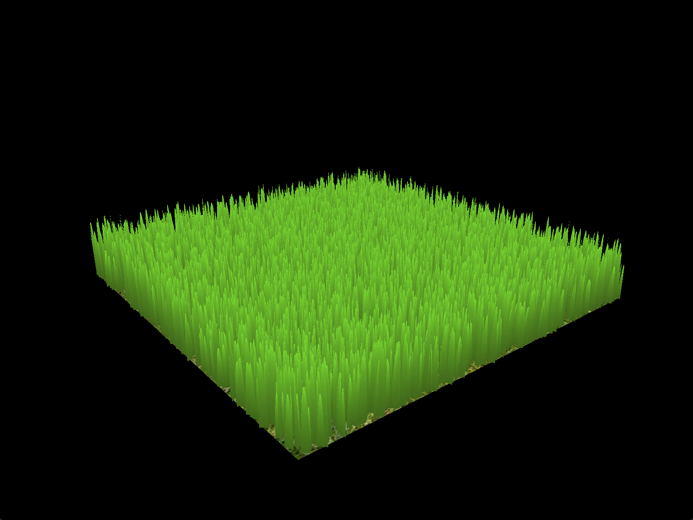
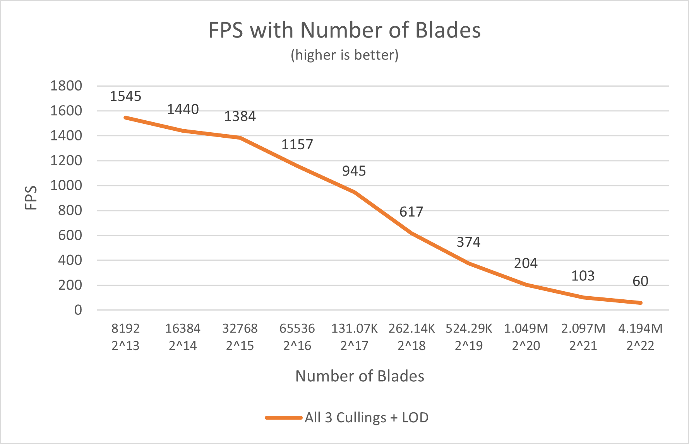
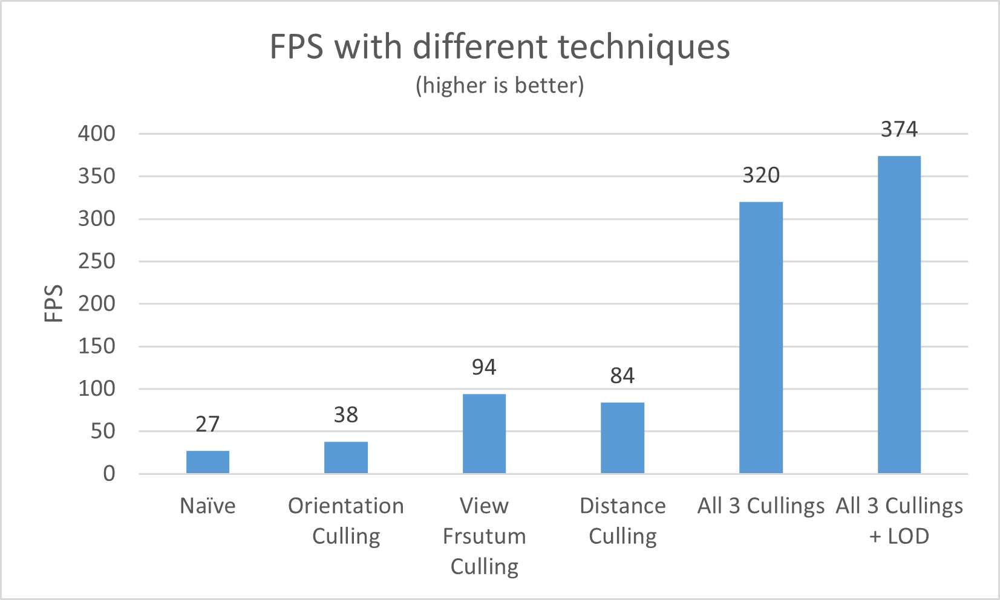

# Vulkan Grass Rendering

**University of Pennsylvania, CIS 565: GPU Programming and Architecture, Project 5**

-   Yu Jiang
-   Tested on: Windows 11, Ultra 7 155H @ 3.80 GHz, 32GB RAM, RTX 4060 8192MB (Personal Laptop)

### Final Result

### Overview

This project is an implementation of [Responsive Real-Time Grass Rendering for General 3D Scenes](https://www.cg.tuwien.ac.at/research/publications/2017/JAHRMANN-2017-RRTG/JAHRMANN-2017-RRTG-draft.pdf) in Vulkan, including features of :

-   Rendering grass realtimely in vulkan using Bezier curves.
-   Simulating **Gravity, Recovery, and Wind** forces in Vulkan compute shaders.
-   Dynamic culling blades by **Orientation, Distance and View Frustrum** in Vulkan compute shaders.
-   Dynamic LOD by controlling tessellation levels in Vulkan tessellation shaders.

### Features

#### 1. Basic Render without physics

Implemented the Vulkan render pipeline and the tessellation evaluation shader to compute the generated vertex position according to the paper. I used triangle shape grass in the implementation.

#### 2. Add simulation of forces

Add gravity, recovery and wind forces to the grass. For the wind part I used a simplex noise wind field, the noise function is found from [iq](https://www.shadertoy.com/view/Msf3WH).

#### 3. Orientation Culling

This is the effect of orientation culling with `angle_threshold = 0.9`, blades which parallel with the view vector will be culled to ensure very thin blades will not be drawn.

#### 4. View Frustrum Culling

This is the effect of View Frustrum culling, to make the culling visible in the viewport, I used a negative `viewCullingTolerance = -0.1f` to show the results.

#### 5. Distance Culling

As camera moves away from the blades, the density of blades will decrease gradually. This is impleneted with deviding distance into 8 buckets and removing different number of blade indices in different buckets.

#### 6. LOD

In this implementation, I changed the value of `gl_TessLevelInner` and `gl_TessLevelOuter` to control the LOD level. In the gif, I used `maxLevelV = 16` and `minLevelV = 2`; `maxLevelH = 4` and `minLevelH = 1`. The levels are computed by `int(round(mix(maxLevelV, minLevelV, clamp(dist / maxDistance, 0.f, 1.f))))` where `dist` is the distance from blade to camera and `maxDistance` is 32 here.

#### 7. Rendering

At last I change the fragment shader and pipeline settings: I used blinn-phong model with varying `ks` based on `uv.y` to make a specular highlight on the grass blades, and I changed the clear color to `{ 0.5f, 0.635f, 0.743f, 1.0f }` to create a blue sky. After that we get the result at the beginning.

### Performance Analysis

#### Performance with Number of Blades

To test performance with number of blades, I fixed resolution to 1600\*1200, and fixed the size of plane with `planeDim = 120.f`, then only change `NUM_BLADES`. And the figure is shown below:

Except when number of blades < 2^15 where CPU is somewhat bounded, the fps decreases linearly with the number of blades in the curve. This is the expected result.

#### Performance with Different Optimizations

I tested the fps with different optimizations using 2^19 number of blades, the result is shown below:

From the graph we can figure out that Orientation Culling is more about "cutting out blades with alias", so it gives relatively smaller performance gain. While View Frustrum Culling and Distance Culling improves really a lot on FPS, because they culled really many of the blades outside the screen or far away. Combining all three cullings makes the program run 11 times faster than before, which is a really huge improvement! And LOD also introduces about 20% performance gain without significant visual loss.

### References

-   [Simplex Noise from iq](https://www.shadertoy.com/view/Msf3WH)
